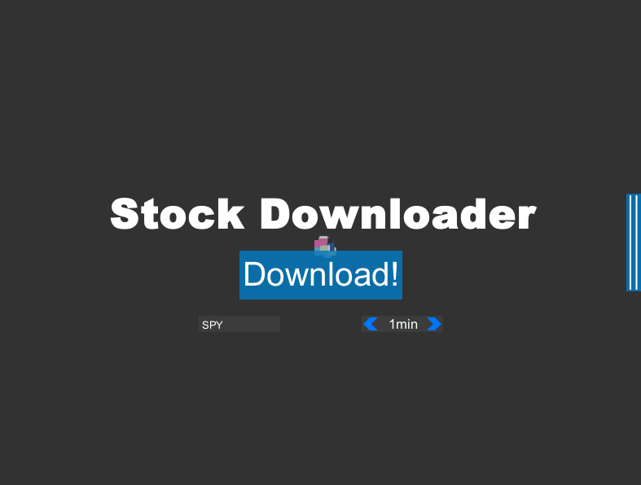
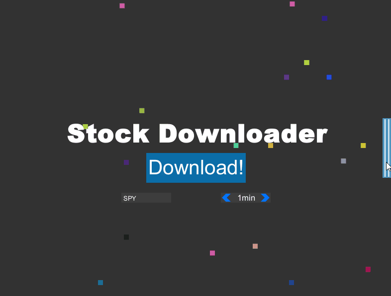
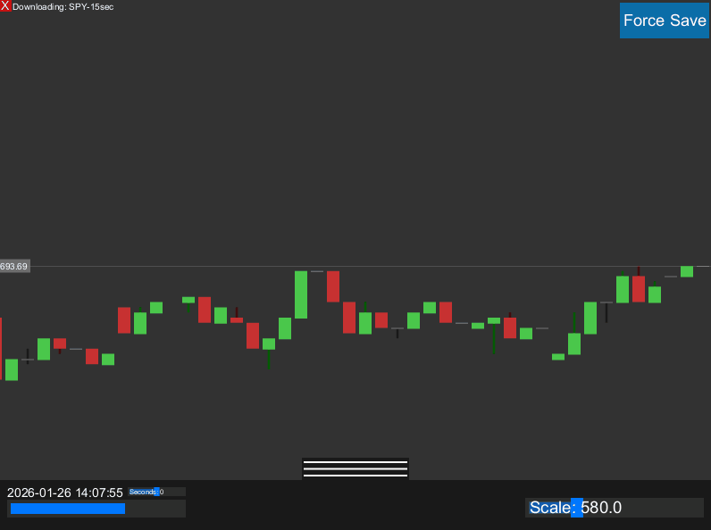
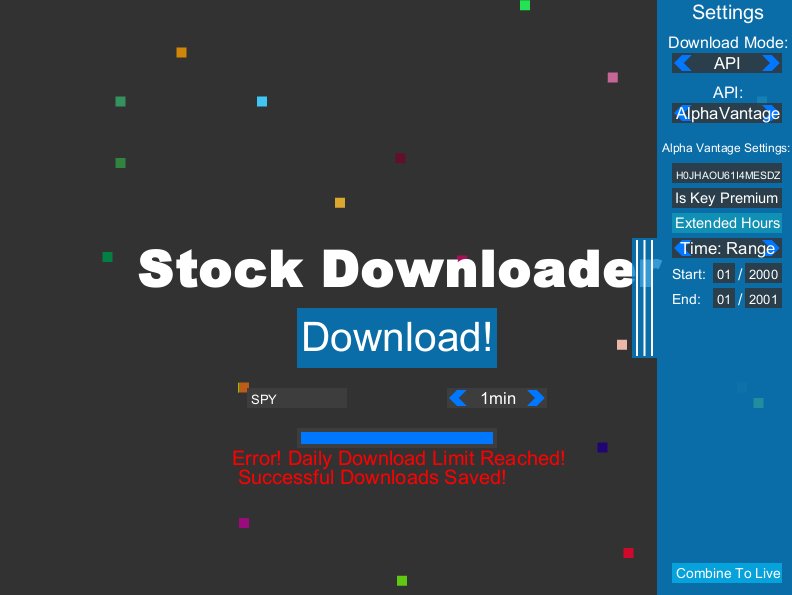
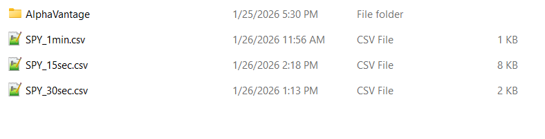

# StockDownloader

I don't want to pay for an API, so I made an application to scrape stock data from the web using JSoup.

The program can run on any always-on server in order to constantly recieve and archive data.

My Stock Data Downloader application is a simple app that downloads live stock data to a CSV file depending on the selected time frame. 
The app has a GUI that makes it fun to watch the stock download. 
This application is built using GlowUI and GlowLib

PLANS:
Eventually, this program will have the capability to be retrieved by other devices across the internet.
Portions of the program will be able to be adapted to a statistical analysis program in the future

# Main Menu Sidebar

*Mode Selector*
- This will set the mode to either API mode or Live Download mode
  
*Mode Options*
- All data for Live Download can be set including: Download Source, Extended Hours
- All data for API mode can be set including: Download Timeframe, API Key, Extended Hours
- Live data & API data can be combined into one data file through the button at the bottom of the sidebar

# Live Download Mode
The Live Download mode is meant to be run, awlays on, on a server.
The mode will procerudally generate a CSV file of stock data that can be used by other applications.

*Visual Downloader*
- As the downloader creates a CSV file, it will display the stock data as candles on the GUI screen.
- It will also display the seconds left of the candle, the current price, and can display all candle data through a hovered tooltip
  

*Source*
- Selected from the sidebar, the source of the Live mode can be selected, as price is scraped from the web using JSoup
  - Sources include: Yahoo Finance, Google Finance, MarketWatch, Investing.com

# API Download Mode
API download mode generate the CSV file using API data.
The only current API option that is linked is AlphaVantage (You must provide the API key for it to work)

*How to use*
- Selected API mode on the sidebar
- Fill out the desired settings
- Click download, a progress bar will appear, and a message will be displayed based on the status

# File Formatting
Download files from Live and API are compiled into the same formatted .csv file

*File Naming*
- All files are stored in the stock_data folder located at the root of the run project
- File is named "TICKER_TIMEFRAME_YEAR_MONTH"

*File Inside*
- All files are formatted, line by line in the order for the CSV
  - DatetimeID (year-month-day-hour-minute-second)
  - open
  - close
  - min
  - max

